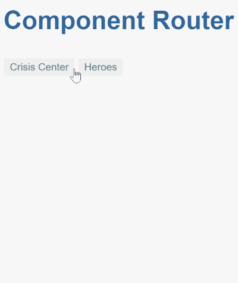

# Несколько маршрутизаторов в Angular 7/8 (вспомогательные маршрутизаторы)

* Tour of Heroes tutorial
    * https://angular.io/guide/router
    * [Tour of Heroes: Services example code](https://angular.io/generated/zips/toh-pt4/toh-pt4.zip)
    

* http://localhost:4200/crisis-center
    
* http://localhost:4200/crisis-center(popup:compose)
    
* http://localhost:4200/crisis-center(outlet:1)
    


**(** [Несколько маршрутизаторов в Angular 4/5 (вспомогательные маршрутизаторы)](https://github.com/Home-AngularJS/angular4_5-multiple-router-demo) **)**

+ Другие ссылки
    + `A simple Angular 2 app demonstrating parallel named router outlets`
    + https://stackoverflow.com/questions/38038001/multiple-named-router-outlet-angular-2
    + `ng2-named-router-outlets` https://github.com/onehungrymind/ng2-named-router-outlets

---

## How to use?

Next, navigate inside the cloned folder then install the dependencies using:

```bash
cd angular-router-demo
npm install
```

You can the serve your demo project using:

```bash
ng serve
```

Finally, visit `http://127.0.0.1:4200` with your browser.

