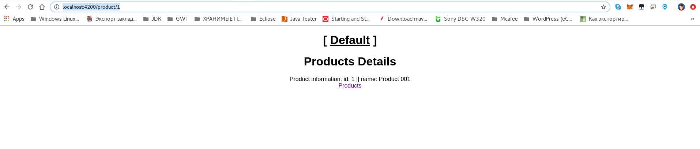
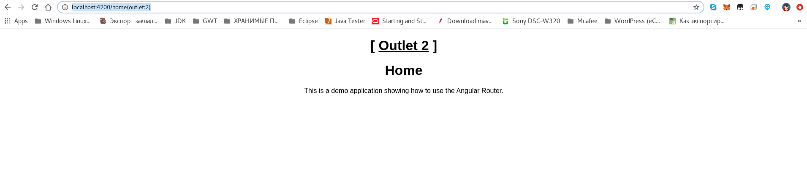

# Несколько маршрутизаторов в Angular 4/5 (вспомогательные маршрутизаторы)

* The Angular 4/5 Router: Named and Multiple Router-Outlets (Auxiliary Routes)
  * https://www.techiediaries.com/angular-router-multiple-outlets
  * [angular-router-demo](https://github.com/techiediaries/angular-router-demo)


1. В [polyfills.ts](polyfills.ts) добавить `import "core-js/es7/reflect";`
    ```angular2
    /** Evergreen browsers require these. **/
    // Used for reflect-metadata in JIT. If you use AOT (and only Angular decorators), you can remove.
    import "core-js/es7/reflect";
    ```
2. В [index.html](index.html) добавить `<base href="/">`
    ```html
    <head>
        <title>Multiple Router-Outlets (Auxiliary Routes)</title>
        <base href="/">
    </head>
    ```
3. В [app.component.html](app.component.html) именуем вспомогательный маршрутизатор и устанавливаем порядок маршрутизаторов (**router-outlet**) на веб-странице - сначала должен стоять вспомогательный маршрутизатор, а потом основной (дефолтный) маршрутизатор.
    ```html
        <router-outlet name="outlet"></router-outlet>
        <router-outlet></router-outlet>
    ``` 
4. Создаем компоненты например стилей для каждого отдельного маршрутизатора (`sidebar`,`without-sidebar1`,`without-sidebar2`) 
5. Подключаем эти компоненты маршрутизаторов в модуле [routing.module.ts](routing.module.ts) и маркируем эти компоненты маршрутизаторов (не забываем указывать компонент маршрутизатора по умолчанию!)
    ```angular2
    const routes: Routes = [
      { path: "", component: DefaultOutletComponent, outlet: "outlet" },
      { path: "1", component: Outlet1Component, outlet: "outlet" },
      { path: "2", component: Outlet2Component, outlet: "outlet" },
    ```
6. Для всех вспомогательных компонентов маршрутизаторов используем в ссылке `<HOST>/<PATH>(<OUTLERS>:<OUTLER-NAME>)`

---

* `Default`
  
  * (`Home`) http://localhost:4200/home
    
  * (`Products`) http://localhost:4200/products
    
  * (`Products Details 1`) http://localhost:4200/product/1
    
* `Outlet 1`
  * (`Home`) http://localhost:4200/home(outlet:1)
    
  * (`Products`) http://localhost:4200/products(outlet:1)
    
  * (`Products Details 1`) http://localhost:4200/product/1(outlet:1)
    
* `Outlet 2`
  * (`Home`) http://localhost:4200/home(outlet:2)
    
  * (`Products`) http://localhost:4200/products(outlet:2)
    
  * (`Products Details 1`) http://localhost:4200/product/1(outlet:2)
    

**(** [Несколько маршрутизаторов в Angular 7/8 (вспомогательные маршрутизаторы)](https://github.com/Home-AngularJS/angular7_8-multiple-router-demo) **)**

---

## How to use?

Next, navigate inside the cloned folder then install the dependencies using:

```bash
cd angular-router-demo
npm install
```

You can the serve your demo project using:

```bash
ng serve
```

Finally, visit `http://127.0.0.1:4200` with your browser.
